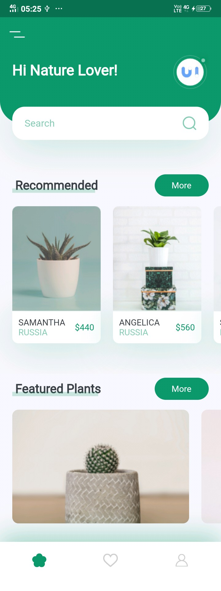

# PlantApp
In this application I have explored some new insights in UI also the way the code is managed into different is one of the ideal ways of organizing Code in Flutter. This application is inspired by the following repository: https://github.com/abuanwar072/Plant-App-Flutter-UI
 
Following are the images of the UserInterface:
  

